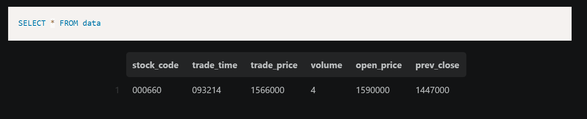
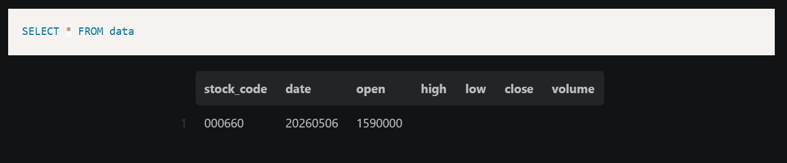

# lambda_clean

Lambda function that parses Bronze raw messages, validates records, and writes Silver Parquet outputs.

---
# AWS Kinesis Data Streams 생성

## 콘솔 접속
- 순선 : AWS 콘솔 → Kinesis → 데이터 스트림 생성
- 설정값
    - 스트림 이름   : de-ai-07-processing-stream 
    - 리전         : ap-northeast-3 (오사카)
    - 용량 모드     : 온디맨드 (On-demand) ← 자동 조정 · 비용 절감
    - 최대 레코드   : 1024 KB (= 1MB · Kinesis 기본 한도)
                    한투 메시지는 약 1KB 미만이라 한도 초과 없음

## 생성 후 작업
- .env 업데이트
```
KINESIS_STREAM=de-ai-07-processing-stream
KINESIS_ARN=arn:aws:kinesis:ap-northeast-3:827913617635:stream/de-ai-07-processing-stream
```

---
# S3 → EventBridge → Kinesis 연결
## 전체 흐름
```
S3 Bronze 파일 적재
        ↓
S3 이벤트 발생
        ↓
EventBridge 규칙 감지
        ↓
Kinesis processing-stream 으로 전달
```

## S3 이벤트 알림 활성화
### AWS 콘솔
→ S3 → de-ai-07-827913617635-ma-proj 버킷 클릭 → 속성(Properties) 탭 → Amazon EventBridge 섹션 → "이벤트 알림 전송" → 활성화(ON)

## EventBridge 규칙 생성
### AWS 콘솔
→ EventBridge → 규칙(Rules) → 규칙 생성

### 규칙 이름   : s3-bronze-to-kinesis
```
이벤트 버스 : default
이벤트 소스 선택
✅ AWS 이벤트 또는 EventBridge 파트너 이벤트
   └─ S3 같은 AWS 서비스 이벤트를 감지하기 위한 선택지

이벤트 패턴 생성 방법
✅ 사용자 지정 패턴 (JSON 편집기)
   └─ raw/ prefix 등 세밀한 조건 설정 가능

JSON 패턴 입력
json{
  "source": ["aws.s3"],
  "detail-type": ["Object Created"],
  "detail": {
    "bucket": {
      "name": ["de-ai-07-827913617635-ma-proj"]
    },
    "object": {
      "key": [{
        "prefix": "raw/"
      }]
    }
  }
}

대상(Target) 설정
서비스       : Kinesis Data Streams
스트림       : de-ai-07-processing-stream
파티션 키    : $.detail.object.key

실행 역할(IAM)
✅ 이 특정 리소스에 대해 새 역할 생성
   └─ EventBridge → Kinesis 권한을 AWS가 자동 설정
```

---
# handler.py
## 의미와 역할
- S3 Bronze에 적재된 원본 구분자 문자열을 읽어서 파싱
- 문자열을 정제 후 S3 Silver 두 경로에 저장
- Kinesis가 트리거하면 자동으로 실행
- Bronze → Silver 변환의 핵심

## 담아야 할 내용 순서
```
1. 환경변수 로드
   └─ S3_BUCKET · AWS_REGION 읽기

2. S3 클라이언트 초기화
   └─ boto3.client("s3") 생성

3. 원본 문자열 파싱 함수
   └─ 구분자(|) 로 분리 → payload 추출
   └─ 구분자(^) 로 분리 → 필드 추출
   └─ 추출 필드:
       stock_code  · trade_time · trade_price
       trade_volume · open_price · prev_close
   └─ 문자열 → int / float 타입 변환
   └─ 유효성 검증 (결측값 · 이상값 제거)
   └─ 장외시간 데이터 필터링
       market_config.py 의 is_market_time() 활용

4. Silver 체결 데이터 저장 함수
   └─ 파싱 결과 → pandas DataFrame 변환
   └─ Parquet 포맷으로 변환
   └─ path_config.py 의 silver_trade_key() 로 경로 생성
   └─ S3 PutObject 로 Silver 체결 경로에 저장

5. Silver 일봉 데이터 저장 함수 (★ 핵심)
   └─ 당일 첫 체결가 → open_price 추출
   └─ 이미 오늘 시가가 저장됐는지 확인
       └─ 저장됐으면 skip (하루에 한 번만 저장)
       └─ 없으면 S3 daily/ 경로에 저장
   └─ path_config.py 의 silver_daily_key() 로 경로 생성
   └─ 과거 종가 데이터와 합쳐서 저장

6. Kinesis 이벤트 핸들러 (Lambda 진입점)
   └─ Kinesis 레코드에서 S3 이벤트 정보 추출
   └─ S3 Bronze 에서 원본 파일 읽기
   └─ 3번 파싱 함수 호출
   └─ 4번 Silver 체결 저장 함수 호출
   └─ 5번 Silver 일봉 저장 함수 호출

7. 로깅
   └─ 파싱 성공 · 실패 로그
   └─ Silver 적재 성공 · 실패 로그

주의사항
⚠️ 5번 일봉 저장 함수
   오늘 시가는 하루에 한 번만 저장해야 해요.
   Lambda가 1분마다 실행되므로
   이미 저장됐는지 확인하는 로직이 반드시 필요해요.

⚠️ 한투 API 원본 필드 순서
   0|H0STCNT0|004|005930^102305^78500^5^3200^248720^78200^78600^75300^...
                          [0]    [1]   [2] [3]   [4]    [5]   [6]   [7]
   stock_code  = [0]  005930
   trade_time  = [1]  102305
   trade_price = [2]  78500
   trade_volume= [3]  3200 (또는 [5] acml_vol)
   bid_price   = [5]  78200
   ask_price   = [6]  78600
   prev_close  = [7]  753
```
## lambda_clean 배포 · 테스트
### 테스트 전략
```
저장해둔 체결 데이터
        ↓
S3 Bronze 경로에 수동 업로드
        ↓
EventBridge 이벤트 발생
        ↓
Kinesis 트리거
        ↓
Lambda handler.py 실행
        ↓
S3 Silver 경로에 Parquet 적재 확인
```
### Step 1 — Lambda 함수 생성
AWS 콘솔
→ Lambda
→ 함수 생성
   - 함수 이름 : de-ai-07-lambda-clean
   - 런타임    : Python 3.11
   - 리전      : ap-northeast-3 (오사카)
   - 실행 역할 : S3 · Kinesis 권한 있는 IAM 역할

→ 함수 계층(layer) 편집
   - 레이어 추가 → AWS 레이어 선택 → AWSSDKPandas-Python311 색 → 최신 버전 선택 → 추가

### Step 2 — 코드 업로드 상세 설명
- handler관련 모든 라이브러리를 `zip`으로 변환하여 `Lambda`에 직접 업로드
1. 패키지 폴더 생성
```bash
cd Onedrive/문서/

# 프로젝트 루트에서
mkdir lambda_clean_package
```

2. 의존 라이브러리 설치
```bash
# 외부 라이브러리 중 작은 것만 설치
# pandas · pyarrow · boto3 는 Layer 에서 제공
pip install python-dotenv -t lambda_clean/
```

3. 필요한 파일 복사
```bash
# handler.py 복사
cp DE-PROJ/src/lambda_clean/handler.py lambda_clean_package/

# config 폴더 복사
cp -r DE-PROJ/config/ lambda_clean_package/config/

# src/common 복사 (time_utils 등)
cp -r DE-PROJ/src/common/ lambda_clean_package/src/common/
```
4. `ZIP`파일로 압축

5. Lambda 콘솔에서 업로드
```bash
AWS 콘솔
→ Lambda
→ de-ai-07-lambda-clean 함수 클릭
→ 코드 탭
→ 업로드 위치 → .zip 파일
→ lambda_clean.zip 선택
→ 저장
```

6. 코드 소스에서 lambda_clean파일에 있는 파일들 `root`디렉토리로 이동시키기 -> `Undeploy` 클릭

7. 진입점 설정
```bash
런타임 설정
→ 핸들러 : handler.lambda_handler
           └─ handler   : 파일명 (handler.py)
           └─ lambda_handler : 함수명
```

8. 환경변수 설정
```
Lambda 콘솔
→ 구성(Configuration) 탭
→ 환경 변수(Environment variables)
→ 편집
→  S3_BUCKET  = de-ai-07-827913617635-ma-proj
   LOG_LEVEL  = INFO
```

9. IAM 권한 확인
```
Lambda 콘솔
→ 구성 탭
→ 권한(Permissions)
→ 실행 역할 클릭 (IAM 콘솔로 이동)
→ 아래 권한 확인

필요한 권한)
✅ AmazonS3FullAccess      (S3 읽기·쓰기)
✅ AmazonKinesisFullAccess (Kinesis 읽기)
✅ AWSLambdaBasicExecutionRole (CloudWatch 로그)
```

### Step 3 — Kinesis 트리거 연결
1. 테스트 이벤트 설정
```
Lambda 콘솔
→ 테스트 탭
→ 새 이벤트 생성
→ 이벤트 이름 : bronze-s3-test
→ 템플릿 : S3 Put 선택
```

2. 테스트 이벤트 JSON 입력
```json
{
  "Records": [
    {
      "s3": {
        "bucket": {
          "name": "de-ai-07-827913617635-ma-proj"
        },
        "object": {
          "key": "raw/000660/date=20260506/hour=09/000660_093214_06ea550e.log"   //이전에 입력받은 bronze단계의 raw_message s3 url값
        }
      }
    }
  ]
}
```

### Step 4 — 저장해둔 데이터로 테스트
```
Lambda 콘솔
→ 테스트 탭
→ 테스트 버튼 실행
```
- `cloudwatch` 로그 확인
   - 로그 그룹명 : `/aws/lambda/de-ai-07-lambda-clean`
   - 로그 스트림탭 확인
      ```
         2026-05-06T11:05:14.530Z
         INIT_START Runtime Version: python:3.11.mainlinev2.v7	Runtime Version ARN: arn:aws:lambda:ap-northeast-3::runtime:a0dd170e909c9230a7e18f978320f0053271b75d0b703c836ab4f98f2e3f6a5a

         INIT_START Runtime Version: python:3.11.mainlinev2.v7 Runtime Version ARN: arn:aws:lambda:ap-northeast-3::runtime:a0dd170e909c9230a7e18f978320f0053271b75d0b703c836ab4f98f2e3f6a5a
         2026-05-06T11:05:17.096Z
         START RequestId: 16e11604-4e90-4c28-a32d-9574d231d42c Version: $LATEST

         START RequestId: 16e11604-4e90-4c28-a32d-9574d231d42c Version: $LATEST
         2026-05-06T11:05:18.316Z
         END RequestId: 16e11604-4e90-4c28-a32d-9574d231d42c

         END RequestId: 16e11604-4e90-4c28-a32d-9574d231d42c
         2026-05-06T11:05:18.316Z
         REPORT RequestId: 16e11604-4e90-4c28-a32d-9574d231d42c	Duration: 1218.36 ms	Billed Duration: 3781 ms	Memory Size: 512 MB	Max Memory Used: 202 MB	Init Duration: 2562.50 ms
      ```
- 실제 s3 저장 데이터 확인
   - 실시간 체결 데이터 : `s3://de-ai-07-827913617635-ma-proj/processed/000660/date=20260506/hour=20/000660_200517_d475e021.parquet`
      - 실제 데이터 테이블
         
   - 일봉 데이터 : `s3://de-ai-07-827913617635-ma-proj/processed/daily/000660/date=20260506/000660_daily.parquet`
      - 실제 데이터 테이블
         


